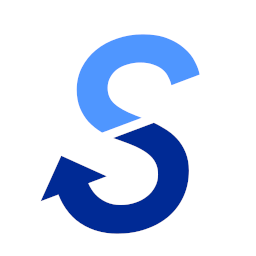

<div align="center">
<a href="https://github.com/takara2314/bsam">
    
</a>

# B-SAM - 視覚障がい者セーリング支援アプリ


</div>

視覚障がいのある方が、セーリング（ヨット競技）をより安全かつ楽しく行えるようにサポートするシステム「B-SAM（Blind Sailing Assist Mie）」の選手用アプリ（メイン）です。

コース上に設置されたブイに搭載されたスマートフォンから、そのブイの位置情報をリアルタイムで取得します。そして、この位置情報を競技者のスマートフォンに送り続け、常に最新のレース状況を把握できるようにします。これにより、視覚情報に頼ることなく、競技者はレースに集中することができます。

## 関連リポジトリ
[本部用アプリ](https://github.com/takara2314/bsam-admin)

[サーバー](https://github.com/takara2314/bsam-server)

[レースモニター（外部公開用）](https://github.com/takara2314/bsam-web)

## 環境構築
開発には以下が必要です。
- Flutter 3.29.3 以上

1. はじめにリポジトリをクローンし、依存関係をインストールしてください。

```sh
git clone https://github.com/takara2314/bsam.git

cd bsam

flutter pub get
```

2. 次に .env.sample を .env にコピーし、環境変数の設定を行ってください。

```sh
cp .env.sample .env
```

3. Firebase Console から以下のファイルをダウンロードし、適切な場所に配置してください。
- Android: `google-services.json` → `android/app/google-services.json` に配置
- iOS: `GoogleService-Info.plist` → `ios/Runner/GoogleService-Info.plist` に配置

## ライセンス
このプロジェクトは [GPL-3.0](./LICENSE) ライセンスの下で公開しています。

### 自由な利用と配布
ソフトウェアを自由に使用、修正、配布する権利が保証されています。
### ソースコードの公開
配布時にはソースコードを提供するか、入手方法を明示する必要があります。
### 派生作品の継承
派生作品も同じGPLv3ライセンスで公開しなければなりません（コピーレフト）。
### 特許権の取り扱い
ソフトウェアに含まれる特許の無償利用を認め、貢献者がユーザーに対して特許訴訟を起こすことを禁止しています。
### 商用利用
営利目的での使用や販売が可能ですが、ソースコードの公開や、派生物へのGPLv3適用などの条件を守る必要があります。

## 開発者
[濱口 宝 (Takara Hamaguchi)](https://github.com/takara2314)

<div align="center">
<small>
© 2022 NPO法人セイラビリティ三重
</small>
</div>
