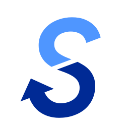

<section align="center">

# B-SAM - 視覚障がい者セーリング支援アプリ 選手用アプリ

</section>

視覚障がいのある方が、セーリング（ヨット競技）をより安全かつ楽しく行えるようにサポートするシステム「B-SAM（Blind Sailing Assist Mie）」の選手用アプリ（メイン）です。

コース上に設置されたブイに搭載されたスマートフォンから、そのブイの位置情報をリアルタイムで取得します。そして、この位置情報を競技者のスマートフォンに送り続け、常に最新のレース状況を把握できるようにします。これにより、視覚情報に頼ることなく、競技者はレースに集中することができます。

## 🔗 関連リポジトリ
[本部用アプリ](https://github.com/takara2314/bsam-admin)

[サーバー](https://github.com/takara2314/bsam-server)

[レースモニター（外部公開用）](https://github.com/takara2314/bsam-web)

## 🛠 前提
- Dart 3.5.3
- Flutter 3.24.3

## ⚖️ ライセンス
このプロジェクトは [GPL-3.0](./LICENSE) ライセンスの下で公開しています。

### 自由な利用と配布
ソフトウェアを自由に使用、修正、配布する権利が保証されています。
### ソースコードの公開
配布時にはソースコードを提供するか、入手方法を明示する必要があります。
### 派生作品の継承
派生作品も同じGPLv3ライセンスで公開しなければなりません（コピーレフト）。
### 特許権の取り扱い
ソフトウェアに含まれる特許の無償利用を認め、貢献者がユーザーに対して特許訴訟を起こすことを禁止しています。
### 商用利用
営利目的での使用や販売が可能ですが、ソースコードの公開や、派生物へのGPLv3適用などの条件を守る必要があります。

## 👨‍💻 開発者
[濱口 宝 (Takara Hamaguchi)](https://github.com/takara2314)

<small>
© 2022 NPO法人セイラビリティ三重
</small>

