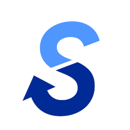

  
  <h1>Blind Sailing Assist Mie - 視覚障がい者帆走支援アプリ</h1>

視覚障がいをお持ちの方がセーリング（ヨット競技）を行うのを支援するスマートフォンアプリです。競技中、指定されたマークまでヨットで向かうとき、音声で方向ナビゲーションを行うことで、走行を支援します。マークは風や波の影響で位置が変わるため、最新の位置情報をリアルタイムに選手スマートフォンに送信しています。

© 2022 NPO法人セイラビリティ三重
